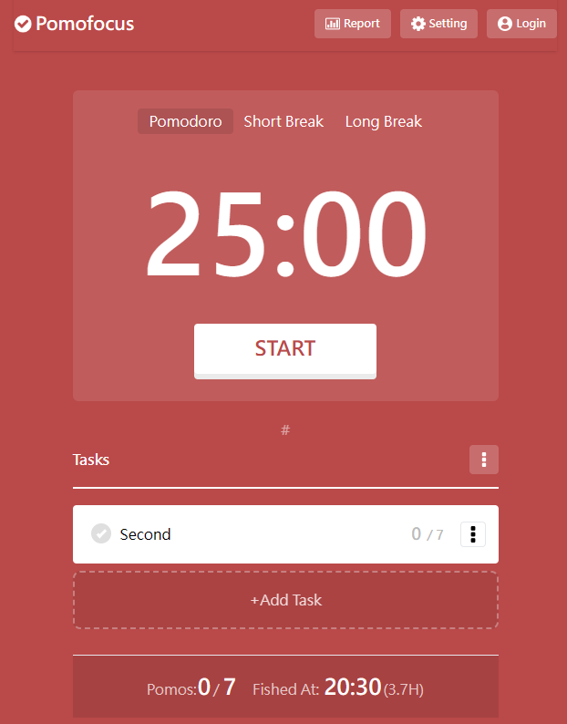

# Pomodoro番茄鐘

這個專案在Vite中使用Vue3進行開發。

## 關於專案



### 專案簡述

> 本專案為學習目的創建

番茄工作法是一種時間管理和工作效率提升的方法。
基本概念是將工作時間劃分為固定的時間段，每段時間為25分鐘，稱為一個「番茄時間」，然後休息5分鐘。這樣的一個工作和休息的循環被稱為一個「番茄週期」。當完成四個番茄週期後，可以進行一個較長的休息，通常為15-30分鐘。

### 專案功能

- 倒計時器應用
- 工作清單編排
- 主題樣式更改
- 模式客製化

### 專案製作原因

專案製作是基於學習目的，為了加深學習前端框架Vue3的使用而創建，希望通過仿製 [Pomofocus](https://pomofocus.io/) ，在實現目標功能的過程中提升前端的技能應用，並且更加深入的研究前端技能。

## 如何使用

### 在開始之前

確保已經安裝[Node.js](https://nodejs.org/)

### 專案建置

```sh
npm install
```

### 當你要開發或是編譯這個專案

```sh
npm run dev
```

### 建議/問題回饋

如果對這個專案有任何的建議或疑惑，歡迎聯絡lydia9017@gmail.com。會盡快地回覆您。
